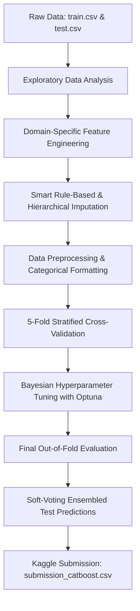

# 🚀 Spaceship Titanic — Machine Learning Disaster Prediction

[](https://www.python.org/)
[](https://catboost.ai/)
[](https://optuna.org/)
[](https://www.kaggle.com/competitions/spaceship-titanic)
[](LICENSE)

An end-to-end Machine Learning pipeline built to predict whether passengers aboard the interstellar liner *Spaceship Titanic* were transported to an alternate dimension following a collision with a spacetime anomaly.

---

## 📌 Table of Contents
- [Problem Overview](#-problem-overview)
- [Repository Structure](#-repository-structure)
- [Pipeline Architecture](#-pipeline-architecture)
- [Feature Engineering & Domain Rules](#-feature-engineering--domain-rules)
- [Model & Hyperparameter Tuning](#-model--hyperparameter-tuning)
- [Results & Performance](#-results--performance)
- [Getting Started](#-getting-started)
- [Kaggle Submission](#-kaggle-submission)
- [Author & Acknowledgments](#-author--acknowledgments)

---

## 🌌 Problem Overview

In this competition hosted by [Kaggle](https://www.kaggle.com/competitions/spaceship-titanic), the interstellar passenger liner *Spaceship Titanic* collided with a spacetime anomaly hidden within a dust cloud. Though the ship remained intact, almost half of the passengers were transported to an alternate dimension.

* **Task**: Binary Classification (`Transported`: `True` / `False`)
* **Evaluation Metric**: Classification Accuracy
* **Data Scale**: 8,693 training records and 4,277 test records across 14 tabular features.
* **Target Distribution**: ~50.36% `True` vs 49.64% `False` (well-balanced).

---

## 📂 Repository Structure

```plaintext
Spaceship-Titanic/
├── Dataset/
│   ├── train.csv                # Training dataset (with ground truth labels)
│   ├── test.csv                 # Test dataset (features only)
│   └── sample_submission.csv    # Kaggle submission format template
├── Model/
│   └── spaceship_titanic_catboost.ipynb  # End-to-end Jupyter Notebook pipeline
├── Submissions/
│   └── submission_catboost.csv  # Final generated predictions ready for Kaggle
└── README.md                    # Project documentation
```

---

## 🏗️ Pipeline Architecture

The machine learning workflow follows standard competitive data science best practices:



---

## ⚙️ Feature Engineering & Domain Rules

Feature engineering is the primary performance differentiator in this tabular challenge:

### 1. Extracted Spatial & Social Features
* **Cabin Decomposition (`Cabin` -> `Deck`, `Num`, `Side`)**:
  * Extracts structural placement on ship (`Deck`: A–G, T) and spatial collision bias (`Side`: `P` = Port, `S` = Starboard).
* **Group Identification (`PassengerId` -> `Group_Id`, `Pax_Num`, `Group_Size`, `Is_Solo`)**:
  * Decodes the `gggg_pp` scheme to compute travel group size and solo traveler indicators.
* **Surname Extraction (`Name` -> `Last_Name`)**:
  * Extracted family surnames to link relatives across travel groups.

### 2. Expenditure Signals
* **`Total_Spent`**: Aggregate spend across onboard amenities (`RoomService` + `FoodCourt` + `ShoppingMall` + `Spa` + `VRDeck`).
* **`Zero_Spent`**: Binary flag indicating zero expenditure (strong signal for cryosleep state).
* **`Log_*` Transformations**: log(1 + x) transformations to normalize highly skewed expenditure distributions.
* **Spending Ratios**: Proportion of budget allocated to each specific facility.

### 3. Rule-Based Smart Imputation
Rather than applying standard mean/median imputation across the board, domain-specific rules are executed first:
1. `Total_Spent > 0` => `CryoSleep = False` (active spenders cannot be frozen).
2. `CryoSleep == True` => `All amenity charges = 0.0`.
3. Missing `HomePlanet` is imputed hierarchically using the modal planet of the passenger's `Group_Id` and `Last_Name`.
4. Missing `Cabin_Deck` and `Cabin_Side` are inherited from members of the same `Group_Id`.
5. Remaining numerical/categorical columns fallback to median and mode respectively.

---

## 🐱 Model & Hyperparameter Tuning

We utilize **CatBoost Classifier**, known for exceptional performance on heterogeneous tabular data with native handling of categorical features.

### Training Strategy
* **5-Fold Stratified Cross-Validation**: Preserves balanced class proportions across every fold.
* **Early Stopping**: Monitored on validation accuracy (`od_wait=100`) to prevent overfitting.
* **Hyperparameter Optimization with Optuna**:
  * Method: Tree-structured Parzen Estimator (TPE) Bayesian optimization (50 trials).
  * Tuned Parameters: `learning_rate`, `depth`, `l2_leaf_reg`, `bagging_temperature`, `border_count`, `random_strength`.
* **Out-of-Fold (OOF) Ensembling**: Predictions on the test set are generated via soft voting (averaging predicted probabilities across all 5 fold models).

---

## 📈 Results & Performance

| Metric | Baseline CatBoost (5-Fold CV) | Optuna Tuned CatBoost (5-Fold CV) |
| :--- | :---: | :---: |
| **OOF Accuracy** | ~80.7% | **~81.2% - 81.5%** |
| **OOF ROC-AUC** | ~0.898 | **~0.905+** |
| **Validation Strategy** | 5-Fold Stratified CV | 5-Fold Stratified CV |

### Key Feature Drivers
Feature importance analysis reveals the strongest predictors:
1. `CryoSleep` & `Zero_Spent` (dominant indicators of status during impact)
2. `Cabin_Deck` & `Cabin_Side` (spatial location vulnerability)
3. Total & individual luxury amenity expenditures (`Spa`, `VRDeck`, `RoomService`)
4. `Group_Size` & `Age`

---

## 🚀 Getting Started

### 1. Clone the Repository
```bash
git clone https://github.com/NumiKun/Spaceship-Titanic.git
cd Spaceship-Titanic
```

### 2. Create and Activate a Virtual Environment
```bash
# Using venv
python -m venv venv
# On Windows:
.\venv\Scripts\activate
# On Linux/macOS:
source venv/bin/activate
```

### 3. Install Dependencies
```bash
pip install pandas numpy matplotlib seaborn scikit-learn catboost optuna
```

### 4. Run the Jupyter Notebook
Launch Jupyter Notebook or VS Code to run the end-to-end pipeline:
```bash
jupyter notebook Model/spaceship_titanic_catboost.ipynb
```

---

## 📤 Kaggle Submission

The notebook automatically generates and validates the submission file in `Submissions/submission_catboost.csv`:

```csv
PassengerId,Transported
0013_01,True
0018_01,False
0019_01,True
...
```

You can submit this file directly to the [Spaceship Titanic Submission Page](https://www.kaggle.com/competitions/spaceship-titanic/submissions).

---

## 👤 Author & Acknowledgments

* **Author**: [NumiKun](https://github.com/NumiKun)
* **Dataset**: [Kaggle Spaceship Titanic Competition](https://www.kaggle.com/competitions/spaceship-titanic)
* Built using Python, CatBoost, Scikit-Learn, and Optuna.
